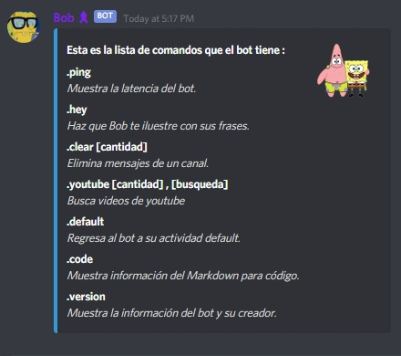

"# Python Discord Bot - Bob Esponja"
ENG - 
This is my first bot using python, i made this repositosy as a guide for those who are new to this lenguage.

If you want to use this bot you'll need a host (Heroku), and if you want to try it using only your pc, you'll need to install
pipenv. Actually, install pipenv, make changes and only deploit it to Heroku when you're finish, it's more practical and simple.

ESP -
Este es mi primer código de un bot en python, es de libre uso y basicamente es una gúia para personas
que esten introduciendo al lenguaje también.

Para el uso correcto de este bot se necesita tener pip y pipenv, para crear un entorno virtual de proyecto.
O bien también pueden hostear el bot en Heroku, tal como lo hice yo, para esto se necesita git y también
seguir los pasos de deploy en la página.

## Screenshots
#### Help Command

